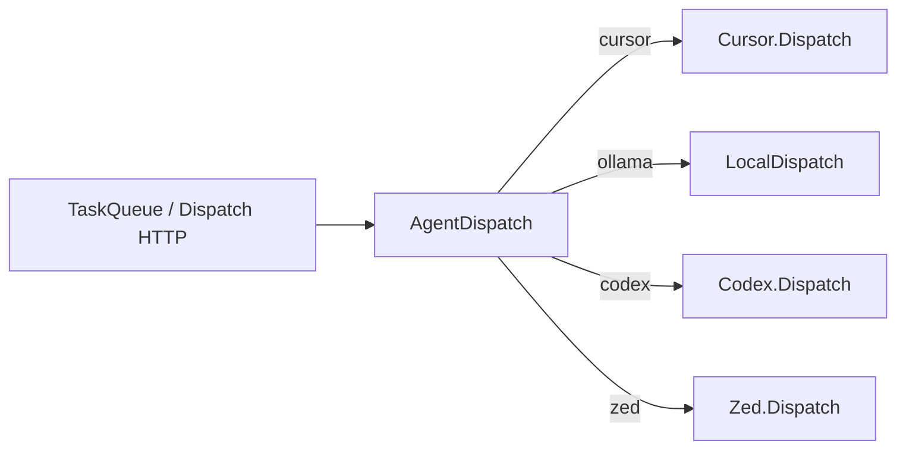

# Multi-agent backends (Cursor, Ollama, Codex, Zed)

**Task:** TASK-55  
**Goal:** Let Symphony dashboard tasks run through any of four local agent backends, selected per task.

## Current state

| Backend | Today | Mechanism |
|---------|--------|-----------|
| **Cursor** | Default for non–local-only tasks | `cursor-agent --print --yolo` via `SymphonyElixir.Cursor` |
| **Ollama** | `local_only` tasks | `SymphonyElixir.LocalDispatch` → chat completion in workspace |
| **Codex** | Linear orchestrator only | `SymphonyElixir.Codex.AppServer` JSON-RPC (`codex app-server`) |
| **Zed** | Not integrated | Zed `eval-cli` headless agent (same pipeline as editor) |

`assigned_agent` exists on tasks but dispatch ignored it (only `local_only` branched).

## Target architecture



**Resolution rules**

1. `local_only: true` → always **ollama** (ignores `assigned_agent` except display).
2. Else `assigned_agent` in `cursor | ollama | codex | zed` → that backend.
3. Else → **cursor**.

Shared steps for Cursor / Codex / Zed:

1. Optional Ollama plan (`auto_plan`).
2. `WorkspaceBootstrap` (linked or isolated + git batch).
3. Run backend CLI in workspace.
4. On success → task status **review** + log events.

## Configuration (WORKFLOW.md)

```yaml
codex:
  command: codex app-server   # existing

zed:
  command: eval-cli             # or full path to Zed eval-cli build
  model: anthropic/claude-sonnet-4-6-latest
  timeout_seconds: 3600
```

Env overrides: `ZED_COMMAND`, `ZED_MODEL`, `ZED_TIMEOUT_SECONDS`.

## UI

- Create / edit task: **Assigned agent** dropdown (`cursor`, `ollama`, `codex`, `zed`).
- Task show: dispatch copy reflects resolved backend; Cursor IDE button only for `cursor`.
- **Local only** checkbox still forces Ollama.

## Implementation phases (this task)

| Phase | Deliverable |
|-------|-------------|
| 1 | `AgentBackend`, `AgentDispatch` router |
| 2 | `Codex.Dispatch`, `Zed` + `Zed.Dispatch` |
| 3 | Wire `TaskController`, `TaskQueue`, slim `Cursor.Dispatch` |
| 4 | UI dropdown + dispatch hints |
| 5 | Tests for agent resolution |

## Follow-ups (later tasks)

- Per-backend auth panels on task show (Codex login, Zed API keys).
- Queue batch commits from linked workspaces without manual copy.
- Orchestrator dashboard: separate Codex slots vs dashboard-task Codex.
- Plan button label: “Plan for agent” when backend ≠ Cursor.

## Verification

1. Create task with `assigned_agent: codex`, linked workspace → Dispatch → log shows `codex app-server` turn.
2. `assigned_agent: zed` → log shows `eval-cli` (or clear “not found”).
3. `local_only` → Ollama regardless of dropdown.
4. `mix test test/symphony_elixir/agent_dispatch_test.exs`
